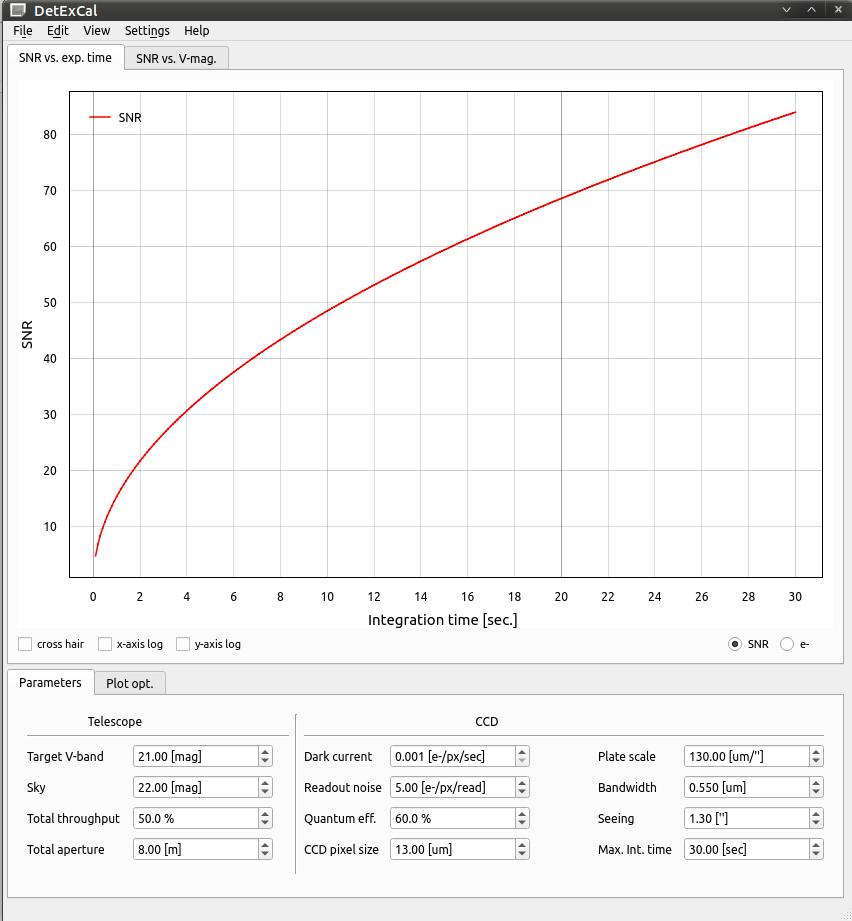
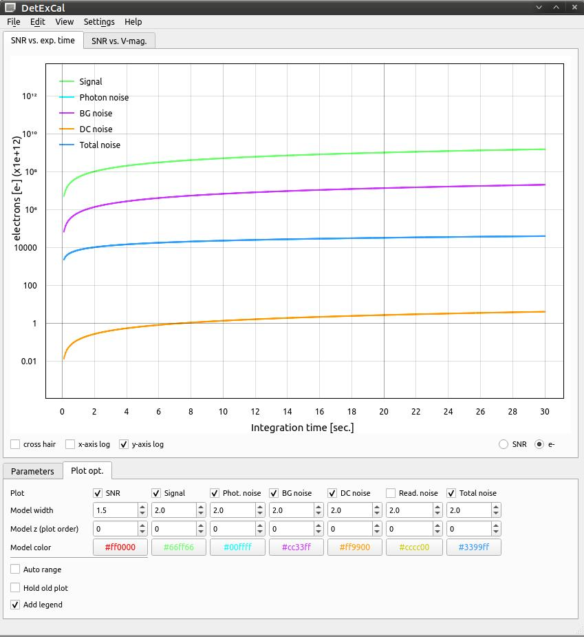

**Det**ector **Ex**posure **Cal**culator: **DetExCal** 
 

     

 
**DetExCal** is a simple CCD-SNR calculator with a convenient GUI interface. It can calculate SNR vs. time and SNR vs. V-band magnitude. 

**Developer**

* Trifon Trifonov, MPIA Heidelberg.

 
Please keep in mind that this software is developed mainly for my needs and for fun. I hope, however, that you may find it capable of solving your scientific problems, too. At the moment, there is NO documentation,
but as you will find, the GUI is self-explanatory.   

Feedback and help in further development will be highly appreciated!
A wish list with your favorite tools and methods to be implemented is also welcome!    

Just open an "Issue" on the GitHub, or send a PM to trifonov@mpia.de.    

**Installation**

Python3.8+ is strongly recommended!!! The DetExCal works with Python3.6,3.7, but if your system Python3 is 3.6 or 3.7, it is recommended to not upgrade the python3, but to install python3.8 alongside your system python3. E.g., [see these instructions](https://linuxize.com/post/how-to-install-python-3-8-on-ubuntu-18-04/)

!!!!!!!!!!!!!!!!!!!!!!!!!!!!!!!!!!!!!!!!!!!!!!!!!!!!!!!!!!!!!!!!!!!!!!!!!!!!!!!!   

Let's assume, you have python3.8, then it is recommended to install pip3.8:

$ curl https://bootstrap.pypa.io/get-pip.py -o get-pip.py   
$ python3.8 get-pip.py    

$ pip3.8 install git+https://github.com/3fon3fonov/DetExCal --user  

or git clone:

$ git clone https://github.com/3fon3fonov/DetExCal   
$ cd DetExCal   
$ python3.8 setup.py install   

Then, to load the GUI, on a bash shell type: 

$ DetExCal 

or, after git clone, simply:

$ git clone https://github.com/3fon3fonov/DetExCal   
$ cd DetExCal   
$ python3.8 DetExCal.py 

 

**Credit**

If you made the use of DetExCal, make me happy and let me know :))) 
 

* The interactive plotting is done with a custom version of the "pyqtgraph": 

http://www.pyqtgraph.org/

* Additionally, DetExCal uses "standard" Python libraries like 
"PyQt5", "numpy", and "scipy".

 
